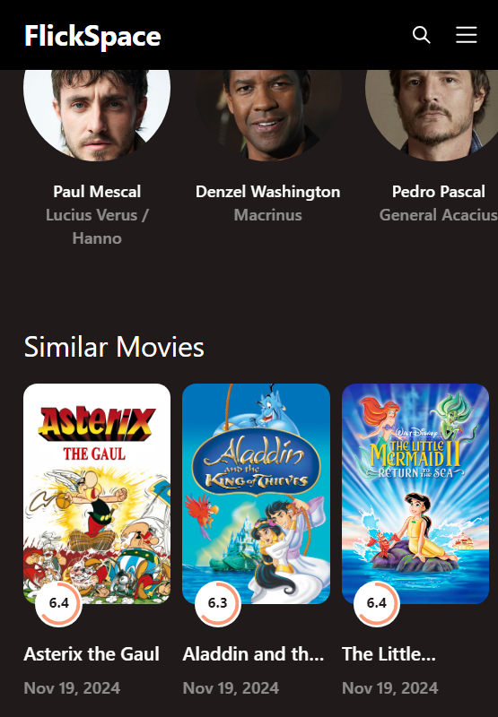

<!-- ## 🔗 Quick Links

1. [Overview](#-overview)
2. [Demo](#-demo)
3. [Features](#️-features)
4. [Getting Started](#-getting-started) -->
<!-- 5. [Configuration](#-configuration)
6. [Examples](#-examples)
7. [Contributing](#-contributing) -->

---

## 🔮 Overview

This movie web app is built using React and offers a seamless way to explore movies with features like detailed information about movies, cast, trailers, and similar movies.

The app boasts a clean and responsive user interface, ensuring a great user experience across devices. Styling is implemented with SCSS for modularity and design precision, while Redux is used for efficient state management. Data is dynamically fetched from the TMDB API, making the app both functional and data-rich.
This project highlights a focus on usability, responsiveness, and modern frontend development practice

## 👾 Demo

https://drive.google.com/file/d/1UQcUajJCR4dq2-GZ1xTVPPsfWujYwMNP/view?usp=sharing

**Screen Shots**

  
  

  

  

<!-- ## ☄️ Features

- **🔒 Secure Authentication:** Users can sign up and log in using secure authentication mechanisms with JWT tokens for session management.
- **🏨 Easy Hotel Booking:** Users can browse and effortlessly book hotels, ensuring a seamless user experienc.
- **📋 Hotel Listing:** Users can browse and effortlessly book hotels, ensuring a seamless user experience.
- **💎 User-Friendly Interface** Create boilerplate README files offline, without any external API calls.
- **🎯 Responsive Design:** Optimized for devices of all sizes, ensuring usability across desktops, tablets, and mobile device. -->
